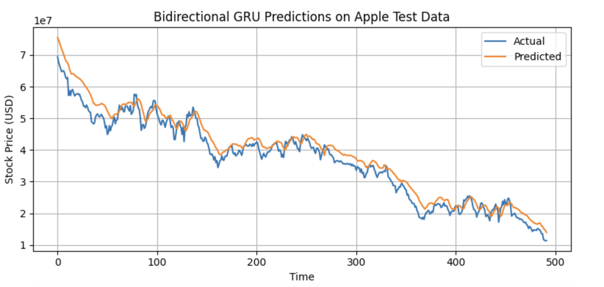
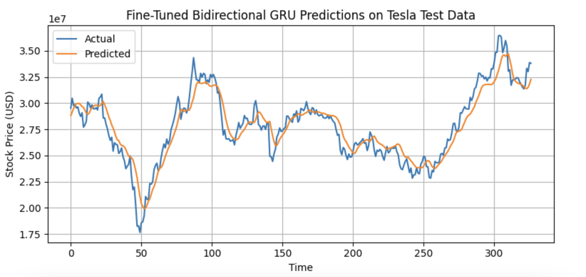

# 📈 Stock Price Prediction using RNNs

This project aims to predict stock prices of **Apple** and **Tesla** using multiple deep learning models, including LSTM, GRU, Bidirectional LSTM, and Bidirectional GRU. The models are trained on historical stock data and fine-tuned for high accuracy on unseen data.

---

## 🔧 Tech Stack

- **Languages:** Python
- **Libraries:** NumPy, Pandas, Scikit-learn, TensorFlow (Keras), Matplotlib
- **Models Used:**
  - GRU
  - LSTM
  - Bidirectional LSTM bkjbyuvui
  - Bidirectional GRU

---

## 📊 Dataset

Two datasets are used:
- `apple_stock.csv` — containing Apple’s historical stock data.
- `tesla_stock.csv` — containing Tesla’s historical stock data.

The data consists of:
- Date
- Open
- High
- Low
- Close
- Volume

---

## 🧼 Data Preprocessing

- Cleaned column names and removed extra characters like `$`.
- Removed unnecessary fields (e.g., `Adj Close`).
- Scaled numerical features using `MinMaxScaler`.
- Created time-series input sequences using a 60-day look-back window.

---

## 🧠 Model Architecture

Each model follows a basic architecture:
- Input Layer (60 time steps × 5 features)
- Recurrent Layer (GRU / LSTM / Bidirectional)
- Dropout Layer (to prevent overfitting)
- Dense Output Layer (predicting the next closing price)

> Optimizer: `Adam`  
> Loss Function: `Mean Squared Error (MSE)`

---

## 🏋️ Training & Evaluation

Each model was trained on **Apple stock data**, and evaluated on test data (20% split). Evaluation metrics include:

- **RMSE (Root Mean Squared Error)**
- **MAE (Mean Absolute Error)**

### 📌 Best Performing Model:
**Bidirectional GRU**  
Achieved the lowest test RMSE and MAE on Apple data and was subsequently fine-tuned on Tesla's dataset.

---

## 🔁 Fine-Tuning on Tesla

The best-performing model (Bidirectional GRU) was fine-tuned on Tesla's stock data.

### Tesla Fine-Tuned Metrics:
- **Train RMSE:** 0.0266
- **Train MAE:** 0.0183
- **Test RMSE:** 0.0324
- **Test MAE:** 0.0253
- **Test MAPE:** 13.31% (≈86.69% accuracy)

---

## 📈 Results & Visualisation

Actual vs Predicted Stock Prices:

- 📉 **Apple Dataset:**
  

- 📉 **Tesla Dataset:**
  

Visuals are generated using `matplotlib`, showcasing model performance over the test period.

---

## 📝 Conclusion

This project demonstrates the power of recurrent neural networks in financial time series forecasting. Among the models tested, the **Bidirectional GRU** delivered the most accurate predictions, generalising well on both Apple and Tesla datasets.

---

## 📬 Contact

For collaboration, queries, or feedback:

**Nipun Kumar**  
[LinkedIn](https://www.linkedin.com/in/nipunkumar01/) | [Portfolio](https://nipun.framer.website)
